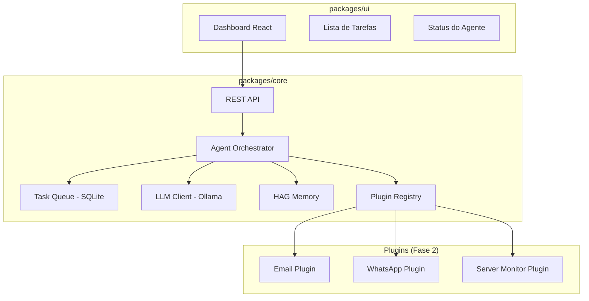
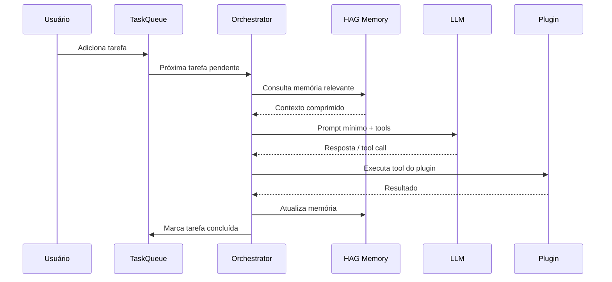

# Arquitetura — Micro Assistente

## Diagrama Geral



## Fluxo de Execução de Tarefa



## Otimização de Contexto

A IA local tem janela limitada. O orquestrador monta prompts mínimos:

| Bloco | Limite aprox. | Conteúdo |
|-------|---------------|----------|
| System | ~200 tokens | Instruções fixas do agente |
| Memory | ~300 tokens | Trechos HAG filtrados por relevância |
| Task | ~100 tokens | Tarefa atual + parâmetros |
| Tools | variável | Apenas tools do plugin necessário |
| Last turn | ~200 tokens | Último resultado, resumido |

**Total alvo:** < 1000 tokens de input por chamada.

## Plugin Interface

```typescript
interface AgentPlugin {
  id: string;
  name: string;
  description: string;
  tools: PluginTool[];
  onLoad?(config: unknown): Promise<void>;
  onUnload?(): Promise<void>;
}

interface PluginTool {
  name: string;
  description: string;
  parameters: JSONSchema;
  execute(args: Record<string, unknown>): Promise<ToolResult>;
}
```

Plugins são carregados dinamicamente pelo `PluginRegistry` a partir de `plugins/` ou via configuração.

## Persistência

- **Tarefas:** SQLite (`data/tasks.db`)
- **Memória HAG:** Diretório configurável (`HAG_PATH`)
- **Config:** `.env` + `data/config.json`

## API REST (Fase 1)

| Método | Rota | Descrição |
|--------|------|-----------|
| GET | `/health` | Status do agente |
| GET | `/tasks` | Listar tarefas |
| POST | `/tasks` | Criar tarefa |
| PATCH | `/tasks/:id` | Atualizar tarefa |
| DELETE | `/tasks/:id` | Remover tarefa |
| POST | `/agent/start` | Iniciar processamento |
| POST | `/agent/stop` | Parar processamento |
| GET | `/agent/status` | Status atual |
| GET | `/plugins` | Plugins carregados |
